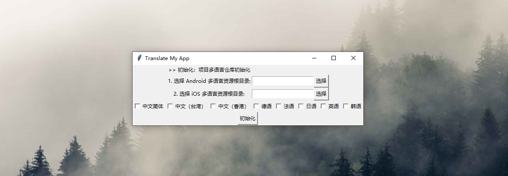
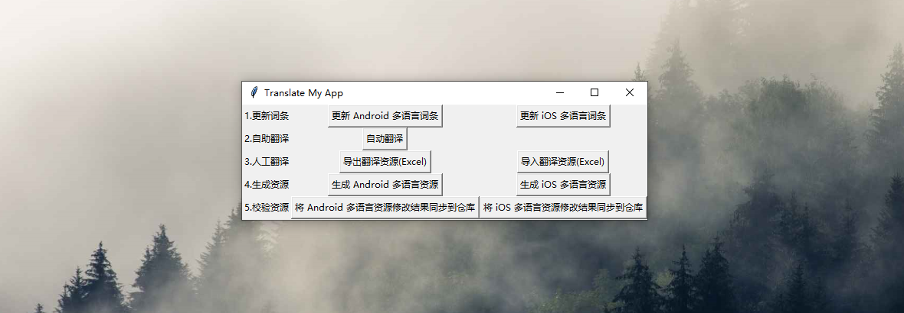

# 多平台、多用户协作的移动应用 (安卓+iOS) 多语言管理工具

## 1、项目背景

TranslateMyApp 项目是我之前为了在 Android 应用中集成多语言而开发的一个工具，当时主要为了解决应用的词条的多语言翻译问题，然而实际应用的时候发现起存在诸多的不便之处。最近当我开发 [言叶APP](https://appgallery5.huawei.com/#/app/C102024597) 的时候，为了减少多语言维护的工作量，重新开发了这个应用。现在它具备了更多功能和特性，可以满足更多的应用场景。该项目基于 Python 开发，项目地址：

- https://github.com/Shouheng88/TranslateMyApp
- https://gitee.com/WngShhng/TranslateMyApp

## 2、功能特性

- 可应用多个移动应用平台：Android 和 iOS 皆可，两端可以共用一份多语言
- 支持用户之间的协作，Android 开发、iOS 开发和产品经理可以共同维护一份多语言
- 支持 GUI 操作，降低了上手难度，不懂程序一样可以使用
- 软件支持多个运行环境：Windows 和 Mac 皆可运行
- 环境配置非常简单，仅需要 Python3 环境以及几个 Python 包即可

## 3、最佳实践

该软件的设计思路是本地维护一份多语言仓库，增、删、改多语言词条都在该仓库完成。每次修改完成之后再使用该软件一键生成应用内的多语言词条。所以，我推荐你 Fork 我们的项目作为自己的多语言仓库，开发者和产品经理可以通过 Git 共同维护一份多语言。建议工作流：

**Step 1**：在 Github 或者 Gitee 上面 Fork 该项目作为自己的多语言资源仓库；

**Step 2**：准备环境。运行该 Python 程序需要做如下配置：

1. 安装 Python3 环境；
2. 安装 Excel 库并准备 Tkinter 环境；

```
pip install requests
pip install xlwt
pip install xlrd
pip install xlutils
```

**Step 3**：在项目的根目录下执行 `python launcher.py` 启动程序，进入仓库初始化界面：



这里你需要先选择 Android 或者 iOS 的多语言**根目录**，并勾选要维护的多语言，然后点击“初始化”来完成仓库初始化。

> 说明：这里各协作用户只要在自己的电脑上面选择自己项目根目录即可，使用 Git 进行同步的时候可以只同步仓库 repo.json 文件，而不同步本地的配置信息。

**Step 4**：完成项目初始化之后，再次使用 `python launcher.py` 启动项目。此时将进入应用的主界面：



该部分功能说明：

1. **更新词条**：用来将客户端多语言词条的修改记录同步到仓库，比如增加或者修改了某个词条。
2. **自助翻译**：使用[百度翻译平台](https://fanyi-api.baidu.com/)平台进行多语言词条的自动翻译（需要在项目的 config 目录下面的 baidu.json 文件中填写在百度翻译平台申请的 app_id 和 app_secret）。
3. **人工翻译**：导出 Excel 修改之后再导入程序中来完成多语言翻译。
4. **生成资源**：分别生成 Android 和 iOS 各自的多语言资源文件。
5. **校验资源**：如果对 Android 和 iOS 多语言资源做了细微的修改可以通过这个功能将其同步到仓库中。

建议版本开发迭代过程中的多语言修改通过“更新词条”完成仓库调整，可以先使用“自助翻译”进行机器翻译减轻工作量，然后使用“人工翻译”进行校对，使用“生成资源”生成了多语言之后发现资源存在问题可以使用“校验资源”将本地修改同步到仓库。

## 4、项目结构

如果你对该项目感兴趣可以通过项目结构了解下我们的代码：

```
|--config
|   |--app.json         应用配置
|   |--baidu.json       百度翻译配置
|   |--languages.json   项目的多语言配置
|   |--repo.json        多语言仓库，项目初始化之后生成
|--app_gui.py           GUI 界面
|--config.py            常量等配置信息
|--file_operator.py     XML Excel File Json 等文件操作封装类
|--generator.py         Excel 和 APP 多语言资源文件生成工具类
|--importer.py          Excel 和 APP 多语言资源文件导入工具类
|--initializer.py       项目初始化、项目多语言、项目配置单例相关
|--launcher.py          启动程序
|--repository.py        用来维护多语言仓库的工具类
|--translatory.py       百度翻译 API 封装，自动翻译等
```

## 5、FAQ

1. Android 词条中的特殊词条如何处理，比如字符串数组、复数资源、HTML 等？

    不建议在 values.xml 文件中使用字符串数组，可以单独一个文件定义，然后引用。复数资源当前版本没有做特殊处理。HTML 和引号等已经在程序中做了特殊处理。

2. 项目会生成很多冗余的多语言资源，比如英语会生成 "en-rUS", "en-rGB", "en-rAU", "en-rCA", "en-rIE", "en-rIN", "en-rNZ", "en-rSG", "en-rZA" 等。

    英语是分成各个地方语种的，如果希望每次只生成一个文件可以在 `config/app.json` 文件中的 `ios_language_black_list` 或者 `android_language_black_list` 中添加需要过滤的黑名单。黑名单上面的多语言不会被自动生成。

3. “校验资源”和“更新词条”的异同？

    假如你维护了 10 种多语言，当你修改了日语下面的词条 a，使用“更新词条”会将其余 9 种多语言对应的翻译置空，来标记该词条发生了变动。而如果你使用了“校验资源”，它只会将你在日语下的修改同步同步到日语对应的词条，而不会修改其它多语言。也就是说，“更新词条”意味着整个词条的翻译需要变更，而“校验资源”仅仅意味着该词条需要做小的调整。

## 6、关于

### 3.1 关于言叶 APP

言叶 APP 是我最近开发的一个应用。它是一个句子创作、收藏和分享平台，为你提供了友好的用户交互环境和优雅的设计，有用又好玩。欢迎大家下载 :)

下载地址是 [https://appgallery5.huawei.com/#/app/C102024597](https://appgallery5.huawei.com/#/app/C102024597)）

### 3.2 关于作者

你可以通过访问下面的链接来获取作者的信息或者关注公众号「Hello 开发者」：

1. Github: https://github.com/Shouheng88
2. 掘金：https://juejin.im/user/585555e11b69e6006c907a2a
3. CSDN：https://blog.csdn.net/github_35186068
4. 简书：https://www.jianshu.com/u/e1ad842673e2

获取更多技术文章（Android、服务端、运维、Python 等）可以直接关注我的公众号「**Hello 开发者**」，另外感兴趣的可以加入技术 QQ 交流群：**1018235573**.

## 7、捐赠项目

我们致力于为广大开发者和个人开发者提供快速开发应用的解决方案。您可以通过下面的渠道来支持我们的项目，

<div style="display:flex;" id="target">


</div>

## License

```
Copyright (c) 2019-2020 Shouheng Wang.

Licensed under the Apache License, Version 2.0 (the "License");
you may not use this file except in compliance with the License.
You may obtain a copy of the License at

   http://www.apache.org/licenses/LICENSE-2.0

Unless required by applicable law or agreed to in writing, software
distributed under the License is distributed on an "AS IS" BASIS,
WITHOUT WARRANTIES OR CONDITIONS OF ANY KIND, either express or implied.
See the License for the specific language governing permissions and
limitations under the License.
```